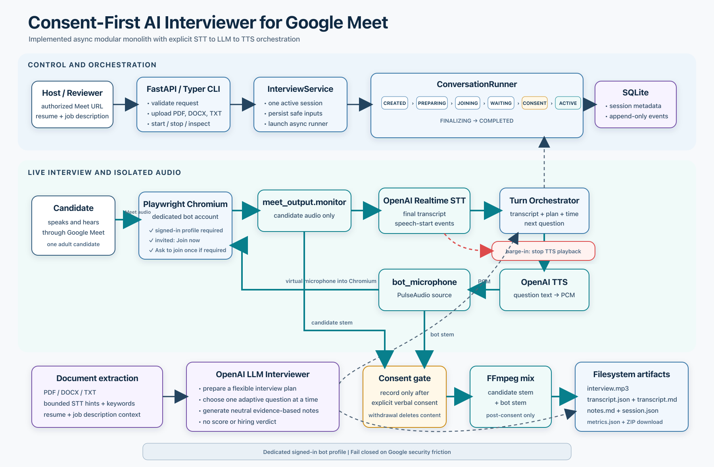

# Interviewer Voice Agent

[](https://github.com/CarboxyDev/interviewer-agent/actions/workflows/ci.yml)

An AI voice interviewer that joins an authorized Google Meet through a dedicated, manually
signed-in bot account. It uses a cascading speech-to-text, LLM, and text-to-speech pipeline to run
adaptive interviews and produce a recording, speaker-labelled transcript, latency metrics, and
evidence-based notes.

## Quick start

Requirements: Docker Desktop, an OpenAI API key, a dedicated Google bot account, and an authorized
Google Meet.

```bash
cp .env.example .env
# Add OPENAI_API_KEY to .env
docker compose build
docker compose up -d
docker compose exec interviewer voice-interviewer browser setup
```

Open `http://127.0.0.1:6080/vnc.html?autoconnect=1`, sign in to the dedicated bot account manually,
then stop the setup command with `Ctrl+C`. The application never automates the account password,
MFA, CAPTCHA, recovery flow, or cookie injection.

Check the runtime:

```bash
docker compose exec interviewer voice-interviewer doctor --live
```

For the guided demo, place exactly one PDF resume and `backend-job-description.txt` in `input/`,
then run:

```bash
scripts/demo-interview.sh
```

The launcher prompts for the Meet URL and duration, starts the interview, prints state changes, and
shows the artifact directory when the session finishes. To start directly with explicit paths, use
the CLI:

```bash
docker compose exec interviewer voice-interviewer interview start \
  --meeting-url 'https://meet.google.com/abc-defg-hij' \
  --resume /input/resume.pdf \
  --job-description /input/backend-job-description.txt \
  --duration-minutes 15 \
  --authorized
```

The CLI also supports status, stop, download, metrics, and deletion commands. The same capabilities
are exposed through the local FastAPI routes documented at `http://127.0.0.1:8000/docs`.

## Safety contract

- The bot uses a manually signed-in dedicated account; anonymous joining is rejected.
- It joins only authorized meetings and never automates credentials or bypasses Google security.
- It records only after explicit consent; withdrawing consent deletes the recorded content.
- It never produces a candidate score or hiring recommendation.

## Storage and retrieval

SQLite stores session state in `data/interviewer.db`; consented outputs are written under
`data/sessions/`. Both locations are excluded from Git. Artifacts and metrics can be retrieved
through either the CLI or the loopback-only API.

## Architecture

The service is an async modular monolith with explicit boundaries for Meet, audio, transcription,
interview generation, persistence, and artifacts. The live interview runs as a cascading STT,
LLM, and TTS pipeline with isolated input and output audio.



More detail is available in the [architecture](docs/architecture.md),
[product requirements](docs/PRD.md), and [configuration](docs/configuration.md) documents.

## Local development

```bash
uv sync --all-groups
uv run playwright install chromium
uv run alembic upgrade head
uv run voice-interviewer doctor
uv run voice-interviewer serve
```

Run all checks with:

```bash
make check
```
