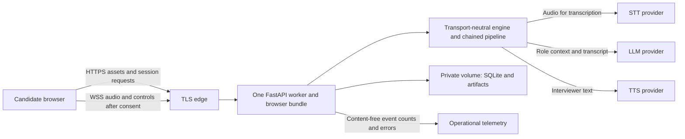

# V2-007: One browser service with bounded private storage

Status: Accepted as the first deployment shape. Date: 2026-09-05.
This is an architecture decision, not a deployed service or authorization to provision paid resources.

## Decision and tradeoff

Target one Fly.io Machine in one region, one Uvicorn application worker, and one persistent volume
for SQLite state and candidate artifacts. Serve the Vite build, FastAPI HTTP endpoints, and browser
WebSocket from the same application origin. Keep one active live interview globally for the first
public demo; show a clear busy state and a synthetic sample/review path when capacity is occupied.

Build a browser-only container composition in M2/M5. It must not boot Chrome, a virtual desktop,
PulseAudio, or a Meet profile. Keep the existing Docker Compose Meet deployment as a local advanced
transport. Do not expose the current unauthenticated V1 API or its browser desktop on the public app.

This shape reuses the repository and artifact boundaries and avoids a database/service migration
before measured demand. It deliberately accepts downtime and loss of short-lived practice data on
volume failure. It is not a high-availability hosting design.

Fly supports configurable volume snapshots. Create a new candidate-data volume with scheduled
snapshots disabled and verify it before accepting any personal content. Turning snapshots off later
does not delete old snapshots. [Fly snapshot documentation](https://fly.io/docs/volumes/snapshots/)

Render was also considered: its persistent disks support a simple single-instance design, but
include automatic snapshots and prevent zero-downtime deploys. The extra copy-retention boundary
makes that default less suitable for the initial immediate-deletion promise. This is our inference
from the documented behavior. [Render persistent disks](https://render.com/docs/disks)

## Data flow

Provider secrets stay on the server. The browser receives application-owned session access, never a
provider key. Document text, audio, and transcripts go only to the stages that need them; sample
replay uses committed synthetic assets without paid provider calls. Personal documents are not
submitted to planning providers before the candidate accepts the disclosed processing flow.

## Ownership, retention, and deletion contract

Audio retention defaults to off. Candidates can opt in separately from required transcription.

These are V2 implementation requirements, not properties of the current V1 service.

| Data | Initial public policy | Enforcement boundary |
| --- | --- | --- |
| Anonymous session access | Opaque high-entropy owner credential in a Secure, HttpOnly, SameSite cookie; store only its verifier | Check ownership on every HTTP and WebSocket operation; validate Origin and protect mutating requests against CSRF; no anonymous cross-session listing |
| Unstarted personal inputs | Maximum 15 minutes from upload; explicit upload disclosure | Temporary private storage; local device check does not send microphone audio |
| Started practice content | Maximum 24 hours from session creation, with immediate candidate deletion | This fixed expiry includes input text, plans, transcript, reports and optional audio; retries do not reset an older attempt's expiry |
| Audio retention disabled | Transient pipeline buffering only | No audio file/stem/mix or audio payload logging; transcription still required |
| Audio retention enabled | Same 24-hour ceiling as the session | Candidate choice shown continuously; stop retaining on withdrawal |
| Raw documents | Remove after context preparation succeeds, or at session expiry on failure | Extracted context remains private and subject to the same session expiry |
| Operational logs | Content-free outcome/error counts and coarse durations | No documents, transcripts, audio, owner cookies, provider tokens, request bodies, or meeting links |
| Candidate-data backups | No scheduled or manual snapshots, exports, or database backups | Verify new volume settings before opening personal mode; commit only synthetic test outputs |

Revoke access immediately on delete/withdrawal, cancel active writers and provider work, purge files
and metadata, and verify completion. A failed purge stays pending and visible as a failure; it must
not report success. Cleanup must be idempotent across disconnects and restart. Expired content is
unreadable at request time even if cleanup is delayed; a periodic sweeper removes it physically.
Startup runs expiry and orphan cleanup before accepting live sessions. SQLite journals, temporary
files, and report jobs are within the cleanup review. No forensic secure-erasure claim is made.

Deleting application copies does not establish deletion from a provider's internal retention or
logs. Verify the actual provider data-handling terms/settings before enabling personal mode and
make that boundary clear in the ready check. M5 must verify both implementation and truthful copy.
If this cannot be established, keep personal mode disabled and use synthetic inputs only.

## Cost and capacity boundaries

- Keep live mode disabled by default until an operator configures a verified global daily budget,
  a per-session maximum cost, and model-specific usage/pricing bounds. Unknown pricing or usage
  attribution disables live admission rather than treating the cost as zero.
- Reserve the worst-case session allowance before provider work, including planning, retries,
  maximum interview duration, closing, report generation, and retry feedback. Reconcile actual use;
  unfinished reservations remain charged until resolved. Persist budget state across restarts.
- Start public live sessions at five minutes, cap them at ten, allow one active session globally,
  and bound output tokens, input size, queued audio, report retries and concurrent provider calls.
  Enforce expiry even if the browser disconnects. A next practice or answer retry consumes a new
  quota/reservation; it cannot bypass the budget through an existing session.
- Add short-window IP abuse controls plus an anonymous-owner quota (initially three live starts
  per rolling day). These supplement the global budget; cookies and IPs alone do not bound spend.
- Keep the Machine count and disk size fixed initially; no autoscaling or automatic disk growth.
  Include compute, volume, network egress and provider charges in the deployment budget. Choose
  machine size and a region after the browser/provider smoke measurements; do not quote unmeasured
  monthly cost or claim a free live demo.
- Maintain a server-side live kill switch. Synthetic sample content, export of already-saved work,
  and deletion should remain available when new paid sessions are disabled.

Automatic stop/start and worker/process settings are explicit deployment settings. Keep the single
Machine running during the initial live demo so cleanup/report tasks and voice connections are not
suspended for inactivity. This is a chosen operational constraint, not a platform uptime claim.
[Fly application configuration](https://fly.io/docs/reference/configuration/)

## Deployment and recovery

- Build immutable browser-service images with frozen Python and npm dependencies. Database changes
  use versioned migrations before serving; readiness must not invoke Meet or a paid provider.
- Drain new live admission before deploying. Wait for active work within its bound, then stop with
  an explicit interruption outcome if necessary. Single-machine deploys may interrupt connections;
  the browser needs a reconnect/review/exit path rather than claiming seamless interview recovery.
- Persist report-stage status so a page can be left safely; resume bounded finalization after a
  process restart. Do not automatically resume audio capture or recreate deleted session content.
- Roll back code to a compatible image. Avoid destructive schema changes; do not restore snapshots
  that could resurrect deleted candidate content. On unrecoverable volume failure, recreate empty
  storage and explain loss honestly. Candidates can export their reports before expiry.
- Revisit Postgres and external artifact storage if concurrency, multiple regions, or durable
  candidate accounts become necessary. That is a later decision requiring admission, ownership,
  deletion and budget consistency across workers; increasing Uvicorn workers alone is unsafe.

V2-501 through V2-504 and V2-509 must verify ownership isolation, budgets, purge/expiry, snapshot
settings, migrations, secure deployment, browser reconnect, and operational limits before V2-505.
V2-007 is complete as a decision; none of these production controls is claimed implemented here.
