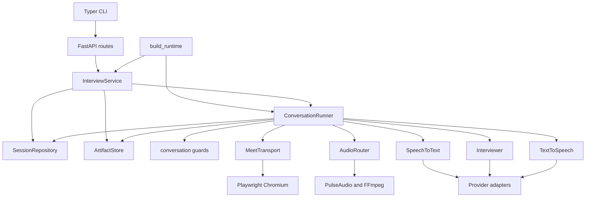

# V1 module map and V2 engine boundary

V2-005. Audited 2026-09-05 against runtime baseline
`dcfd7d45504a33c838464ab152ec6d10f23fc65a`. The V2 planning and fixture commits do not change runtime
source. This is a source audit, not new evidence of live Meet or provider behavior.

## Current composition

Arrows show runtime calls or construction, not exclusively Python imports. The CLI's interview
commands call the HTTP API; its serve, doctor, and browser-setup commands have local entry points.
`build_runtime` constructs one shared runner and connects each protocol to its concrete adapter.

## Complete local import inventory

Generated by parsing imports in the 19 modules under `src/voice_interviewer`; names omit the shared
package prefix. `__init__`, `config`, `domain`, and `metrics` have no local imports. External SDKs
and standard-library imports are omitted from this table.

| Module | Direct local imports | Responsibility |
| --- | --- | --- |
| `__init__` | None | Package metadata |
| `api` | doctor, domain, errors, runtime | HTTP validation, lifecycle control, artifact downloads, readiness |
| `artifacts` | domain | Input files, output allowlist, transcript/notes serialization, content deletion |
| `audio` | domain, errors | PulseAudio capture/playback, interruption, FFmpeg mixed recording |
| `cli` | api, config, doctor, meet | HTTP client commands, API process launch, local browser setup |
| `config` | None | Environment-backed settings |
| `conversation` | domain | Consent, turn intent, question guards, transcription hints, fixed opening/closing |
| `doctor` | config, meet, openai_adapters | Local dependency/browser/audio probes and optional provider probes |
| `documents` | errors | TXT, PDF, and DOCX extraction |
| `domain` | None | Session states, Meet URL validation, speech events, turns, notes, API models |
| `errors` | domain | Domain failure wrappers and control-flow exceptions |
| `meet` | domain, errors | Account/admission checks, retry limiter, participant observation, browser lifecycle |
| `metrics` | None | Timing events, definitions, nearest-rank summaries |
| `openai_adapters` | conversation, domain, errors | Planning, next-turn repair/guarding, notes, streaming STT and TTS |
| `persistence` | domain, errors | SQLAlchemy/SQLite session rows, transitions, restart handling, deletion |
| `ports` | domain | Repository, artifacts, Meet, audio, STT, interviewer, TTS, runner, readiness protocols |
| `runner` | conversation, documents, domain, errors, metrics, ports | Entire session lifecycle and realtime conversation loop |
| `runtime` | artifacts, audio, config, domain, meet, openai_adapters, persistence, ports, runner, service | Adapter composition and service initialization |
| `service` | artifacts, documents, domain, errors, ports | Upload validation, one-active-session admission, background tasks, stop/delete |

## Meet and storage coupling that an import scan misses

`runner.py` already has no direct Playwright or PulseAudio imports. The work in V2-108 is semantic
separation, not merely moving those imports.

| Current boundary | Concrete coupling | Extraction implication |
| --- | --- | --- |
| `SessionCreate`, `Session`, `SessionRow` | Required Meet URL, authorization, resume and job filenames; Meet join/admission states | Browser practice needs transport-independent identity/configuration and transport-specific connection metadata. Preserve V1 API validation for Meet. |
| `ConversationRunner.run` | Prepares docs from `session_dir/input`, joins Meet, waits admission/participant, obtains consent, records, interviews, generates notes, persists outputs, leaves | Session orchestration must own transport readiness, durable lifecycle, recording policy, and finalization around the engine. |
| `_say_and_receive`, `SpeechEventCursor` | One pending STT read, interruption, playback/response deadlines, answer segment aggregation | Preserve cursor ownership and timing semantics when replaying or extracting the engine. These are core behavior, not Meet UI details. |
| `_raise_if_participant_left` | Asks `meet.participant_present()` when speech times out | Browser disconnect, temporary reconnection, and explicit exit cannot all become Meet participant departure. Expose separate lifecycle events. |
| `AudioRouter` | Capture/playback and file-based recording combined in one protocol | Browser audio can use streams without PulseAudio, but optional retention must be independent of STT. Do not implement no-recording mode by disabling transcription. |
| `ConversationRunner` state | Shared stop flag, cursor-related state, latency tracker and model discovery with `getattr` | Keep one active run until per-session ownership is explicit; do not start multiple sessions on one runner. |
| `InterviewService` | In-process task registry and create lock plus `repository.has_active()` | Works with one service process. Multiple workers could race; this is not a distributed admission lock. |
| `ArtifactStore` and runner | File paths escape through `session_dir`; runner re-reads input files directly | Engine inputs should be prepared text/plan and event streams, not filesystem layout. Artifact ownership stays with orchestration. |
| `openai_adapters` | Provider parsing plus turn repair, prior-question filtering and source guards | Provider-neutral invariants must survive a pipeline swap. Moving policy out of adapters requires evaluation coverage first. |
| `runtime`, `doctor` | Always constructs/probes Meet and audio dependencies, even for the app's readiness path | Browser-only composition must not need a signed-in Chrome profile, PulseAudio, or a virtual desktop. Keep an explicit advanced Meet composition. |
| API stop vs withdrawal | API stop sets stop flag/leaves; content deletion is a separate operation; spoken withdrawal deletes content | A browser “end” control must follow graceful finalization. Reusing V1 stop as candidate “end and save” would misrepresent behavior. |

## Data and consent lifecycle

1. `InterviewService.create` validates documents, persists inputs, creates the session, and launches
   the runner. `OpenAIInterviewer.prepare` sends role/resume text for planning before spoken consent.
2. STT starts for the consent exchange; mixed recording starts only after explicit grant. V1 does
   not implement separate transcription consent and optional audio-retention choices.
3. Successful ending stops recording, generates notes, writes allowlisted outputs, and transitions
   to `COMPLETED`. A participant departure attempts to preserve partial outputs as `STOPPED`.
4. Consent decline/withdrawal deletes the session content directory. Session metadata/state remain
   until the separate delete operation. Active-session deletion is rejected by the service.
5. Active silence raises a timeout recorded as `FAILED / INTERNAL_ERROR`; this error path does not
   finalize transcript or metrics. Final cleanup attempts to stop recording and leave Meet.
6. `Runtime.initialize` marks previously nonterminal rows failed after restart. It does not resume
   conversations or perform retention expiry. SQLite deletion and filesystem deletion are separate
   operations, not one atomic transaction.

These details constrain V2's consent copy, optional audio retention, recovery, and deletion claims.
Application content is not automatically safe to publish: exported `session.json` includes the Meet
URL and notes/transcripts contain supplied context. Only authored fixtures are public inputs.

## M1 extraction sequence

- V2-101 through V2-107: define replay events and graders first. Pin cursor ownership, consent,
  interruption, repeat, silence, departure, graceful ending, and failure cleanup observations.
- V2-108: extract `InterviewEngine` with prepared context and per-session event/output boundaries.
  Keep joining, admission, document persistence, recording policy, and artifact finalization outside.
  Map Meet events into that boundary without changing Meet authorization or retry limits.
- V2-109: wrap STT, interviewer, and TTS in a pipeline boundary that preserves transcripts, usage,
  interruption, and timing hooks. Keep deterministic policy checks for every pipeline output.
- V2-110: report engine replay separately from Meet adapter regression and live transport checks.

This map does not authorize an early refactor before the M0 baseline. No transport, provider,
persistence, API, or consent implementation changes are included in V2-005.
